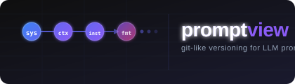

<p align="center">
  
</p>

<p align="center">
  <a href="https://pypi.org/project/promptview/">
    
  </a>
  <a href="https://pypi.org/project/promptview/">
    
  </a>
  <a href="https://www.python.org/downloads/">
    
  </a>
  <a href="https://pypi.org/project/promptview/">
    
  </a>
  <a href="LICENSE">
    
  </a>
  
</p>

<p align="center">
  <b>Git-like versioning and visual management for LLM prompts.</b>
</p>

Prompts in AI applications grow large and hard to manage. PromptView scans your codebase, versions every prompt like git commits, and gives you a visual editor where each prompt is broken into its structural components — which you can add, remove, or edit and have the change reflected back into the original prompt automatically.

---

## Table of Contents

- [Features](#features)
- [Installation](#installation)
- [Quick Start](#quick-start)
- [CLI Reference](#cli-reference)
- [Web UI](#web-ui)
- [LLM Integration](#llm-integration)
- [External Integrations](#external-integrations)
- [How It Works](#how-it-works)
- [Development Setup](#development-setup)
- [pip-installable Package](#pip-installable-package)

---

## Features

- **Auto-discovery** — AST-based scanner finds prompts across OpenAI, Anthropic, LangChain, and raw string patterns
- **Git-like workflow** — `pv scan → pv add → pv commit → pv log`
- **Component graph** — Every prompt is decomposed into labeled nodes (Role, Context, Instructions, Format, Examples…); edit nodes and the prompt updates surgically, preserving your original style
- **Version history** — Toggle between any past version of a prompt in the UI
- **Provider-agnostic LLM** — OpenAI, Anthropic, Gemini, or **Ollama** (local, free, no API key) for decomposition and regeneration
- **Langfuse / LangSmith** — Optional push to external versioning platforms

---

## Installation

### From PyPI (recommended)

```bash
pip install promptview
```

```bash
# With UV (faster)
uv add promptview
```

### With optional integrations

```bash
# Langfuse
pip install "promptview[langfuse]"

# LangSmith
pip install "promptview[langsmith]"

# Both
pip install "promptview[all]"
```

### Requirements

- Python 3.10 or higher
- An API key for at least one LLM provider **or** a locally running [Ollama](https://ollama.com) instance — required only for the component editor (decompose / regenerate). The rest of the tool works without any LLM.

---

## Quick Start

```bash
cd my-ai-project

# 1. Initialize a local prompt repository
pv init

# 2. Scan the codebase for prompts
pv scan

# 3. Stage everything found
pv add .

# 4. Commit the snapshot
pv commit -m "Initial prompt capture"

# 5. Open the visual editor
pv ui
```

The `pv ui` command opens a browser tab at `http://localhost:8765` with the full graph editor.

> **Note:** `pv` and `promptview` are identical aliases — use whichever you prefer.

---

## CLI Reference

### `pv init [PATH]`

Initialize a `.promptview/` repository in the current (or given) directory.

```bash
pv init
pv init ./my-project
pv init --author "Alice"   # set default commit author
pv init --force            # reinitialize existing repo
pv init --no-scan          # skip the automatic first scan
```

---

### `pv scan [PATH]`

Scan the codebase for prompts using AST analysis. Detects OpenAI, Anthropic, LangChain, LiteLLM, and raw string patterns.

```bash
pv scan
pv scan ./src
pv scan --min-confidence 0.7   # only show high-confidence matches
pv scan --show-all             # include low-confidence candidates
```

---

### `pv add [NAME]`

Stage prompts for the next commit.

```bash
pv add .                    # stage everything discovered
pv add "my_prompt_name"     # stage a single prompt by name
pv add --file src/agent.py  # stage all prompts from a specific file
```

---

### `pv commit -m "MESSAGE"`

Commit all staged prompts as a version snapshot.

```bash
pv commit -m "Add tone guidelines to system prompt"
pv commit -m "Refactor retrieval prompt"
```

---

### `pv status`

Show which prompts are staged, modified, or untracked — exactly like `git status`.

```bash
pv status
```

---

### `pv diff [NAME] [V1] [V2]`

Show a unified diff between two versions of a prompt.

```bash
pv diff                          # diff staged vs last commit
pv diff my_prompt                # diff latest two versions
pv diff my_prompt 2 5            # diff version 2 vs version 5
pv diff my_prompt --staged       # diff staged vs HEAD
```

---

### `pv log [NAME]`

Show commit history.

```bash
pv log                    # all commits
pv log my_prompt          # commits that touched a specific prompt
pv log --oneline          # compact one-line format
pv log -n 10              # last 10 commits
```

---

### `pv config [KEY] [VALUE]`

Read or write repository configuration.

```bash
pv config                          # show all settings
pv config --show                   # same as above
pv config author "Bob"             # set default author
pv config llm.provider openai      # set LLM provider for UI
pv config llm.api_key sk-...       # set API key
```

---

### `pv push REMOTE`

Push prompt versions to an external platform.

```bash
pv push langfuse
pv push langsmith
pv push langfuse --dry-run    # preview without uploading
```

---

### `pv ui`

Start the web UI.

```bash
pv ui                      # opens http://localhost:8765
pv ui --port 9000          # custom port
pv ui --host 0.0.0.0       # bind to all interfaces
pv ui --no-browser         # don't auto-open the browser
```

---

### `pv version`

Print the installed PromptView version.

```bash
pv version
```

---

## Web UI

Open the UI with `pv ui`. The interface has two panels:

### Left panel — Prompt list

All prompts discovered in the project are listed here, with their source file, version count, and last-committed date. Click any prompt to open it.

### Right panel — Component graph

The selected prompt is decomposed into its structural components displayed as a **linear node graph**:

```
[Role] → [Context] → [Instructions] → [Output Format] → [Examples]
```

Each node shows a short label and a preview of its content. You can:

- **Click a node** to expand and edit its full text inline
- **Press `+`** between nodes to insert a new component (the LLM suggests appropriate content)
- **Press `×`** on a node to delete it
- **Click "Regenerate"** to apply all pending changes — the LLM rewrites only the affected parts of the original prompt, preserving structure, tone, and style elsewhere

### Version switcher

Every committed snapshot is accessible via the **version selector** (dropdown at the top of the prompt view). Toggle between any past version to compare or restore content. The component graph updates to reflect the selected version.

### LLM settings

Set your provider and API key in the **Settings** panel (gear icon, top-right). Supported providers:

| Provider | Default Model | API Key Required | Notes |
|---|---|---|---|
| OpenAI | `gpt-4o-mini` | Yes (`OPENAI_API_KEY`) | Cloud |
| Anthropic | `claude-haiku-4-5` | Yes (`ANTHROPIC_API_KEY`) | Cloud |
| Google Gemini | `gemini-2.0-flash` | Yes (`GOOGLE_API_KEY`) | Cloud |
| **Ollama** | `llama3` | **No** | Local — free, private |

Keys are stored locally in `.promptview/config.toml` and never leave your machine.

> **Using Ollama?** Install it from [ollama.com](https://ollama.com), pull a model, then select *Ollama (local)* in the settings panel — no API key needed.
> ```bash
> ollama pull llama3   # or: mistral, gemma3, phi3, codellama …
> ollama serve         # starts on http://localhost:11434
> ```

---

## LLM Integration

PromptView uses LLMs for two operations:

1. **Decompose** — break a raw prompt string into labeled components (Role, Context, Instructions, etc.)
2. **Regenerate** — after a node edit/add/delete, rewrite only the changed portion back into the prompt, keeping the rest intact and preserving your original tone and formatting

### Cloud providers (API key required)

```bash
export OPENAI_API_KEY="sk-..."
export ANTHROPIC_API_KEY="sk-ant-..."
export GOOGLE_API_KEY="AIza..."
```

Or set them permanently for the project:

```bash
pv config llm.provider anthropic
pv config llm.api_key sk-ant-...
```

### Ollama — local, free, no API key

Run any open-source model entirely on your own machine:

```bash
# 1. Install Ollama
curl -fsSL https://ollama.com/install.sh | sh

# 2. Pull a model (pick any)
ollama pull llama3       # Meta Llama 3 8B
ollama pull mistral      # Mistral 7B
ollama pull gemma3       # Google Gemma 3
ollama pull phi3         # Microsoft Phi-3 mini
ollama pull codellama    # Code-focused Llama

# 3. Ollama serves automatically on http://localhost:11434
# 4. Open pv ui → gear icon → select "Ollama (local)" → Save
```

No API key needed. All inference stays on your machine.

---

## External Integrations

### Langfuse

```bash
pip install "promptview[langfuse]"

pv config langfuse.public_key pk-lf-...
pv config langfuse.secret_key sk-lf-...
pv config langfuse.host https://cloud.langfuse.com   # optional, defaults to cloud

pv push langfuse
```

### LangSmith

```bash
pip install "promptview[langsmith]"

pv config langsmith.api_key ls__...
pv config langsmith.project my-project   # optional

pv push langsmith
```

---

## How It Works

```
your codebase
     │
     ▼
 pv scan         ← AST visitor walks .py files, detects prompt strings
     │               across OpenAI / Anthropic / LangChain / raw patterns
     ▼
 pv add          ← stages detected prompts into .promptview/index.json
     │
     ▼
 pv commit       ← hashes content, stores in .promptview/promptview.db
     │               creates a commit record with full version history
     ▼
 pv ui           ← FastAPI server + browser UI
                    • LLM decomposes prompt into component nodes
                    • edits are applied surgically via LLM regeneration
                    • all changes create new committed versions
```

**Local storage only.** Everything lives in `.promptview/` inside your project — a SQLite database, a TOML config, and a git-object-style objects directory. Nothing is sent anywhere unless you explicitly `pv push`.

### `.promptview/` directory layout

```
.promptview/
├── promptview.db    # SQLite — prompts, versions, commits, components
├── config.toml      # project config (author, LLM provider, remote URLs)
├── HEAD             # current branch reference
├── index.json       # staging area
├── objects/         # content-addressed object store (like git objects)
├── refs/            # branch and tag references
└── logs/            # commit log files
```

---

## CI/CD Integration

### Pre-commit hook

Automatically block commits if any prompts in the codebase are untracked:

```bash
pv hooks install    # installs .git/hooks/pre-commit
pv hooks status     # check installation status
pv hooks uninstall  # remove the hook
```

### GitHub Actions

Generate a ready-to-use workflow file:

```bash
pv cicd generate --output .github/workflows/promptview.yml
```

This adds a PR check that:
1. Scans for any untracked prompts (`pv scan --fail-on-untracked`)
2. Optionally runs eval regression checks (uncomment the eval step and add your API key secret)

A copy of the template is at [`assets/github-actions/promptview.yml`](assets/github-actions/promptview.yml).

---

## Development Setup

Clone the repo and install in editable mode with UV:

```bash
git clone https://github.com/your-org/promptview.git
cd promptview

# Install UV if you don't have it
curl -LsSf https://astral.sh/uv/install.sh | sh

# Create venv and install all dependencies
uv sync

# Run the CLI directly
uv run pv --help

# Run tests
uv run pytest
```

### Project layout

```
src/promptview/
├── cli/
│   ├── main.py              # Typer app, registers all commands
│   ├── output.py            # Rich formatting helpers
│   └── commands/            # one file per command
│       ├── init.py
│       ├── scan.py
│       ├── add.py
│       ├── commit.py
│       ├── status.py
│       ├── diff.py
│       ├── log.py
│       ├── ui.py
│       ├── push.py
│       └── config.py
├── scanner/                 # AST-based prompt detector
│   ├── base.py
│   ├── ast_visitor.py
│   ├── resolver.py
│   └── result.py
├── storage/                 # SQLite db, repository, models, diff engine
│   ├── db.py
│   ├── models.py
│   ├── repository.py
│   └── diff_engine.py
├── llm/                     # Provider-agnostic LLM client
│   ├── client.py            # OpenAI / Anthropic / Gemini
│   └── decomposer.py        # prompt → components, components → prompt
├── server/                  # FastAPI web server
│   ├── app.py
│   ├── schemas.py
│   └── routes/
│       ├── prompts.py       # CRUD, scan, commit
│       ├── components.py    # decompose, add/delete/edit nodes, regenerate
│       ├── diff.py          # version diffing
│       └── graph.py         # graph data for UI
└── integrations/            # Langfuse, LangSmith adapters
    ├── base.py
    ├── langfuse.py
    └── langsmith.py
```

---

## pip-installable Package

PromptView is packaged with [Hatchling](https://hatch.pypa.io) and ready to publish to PyPI.

### Build the distribution

```bash
# Install build tools
uv add --dev build twine

# Build wheel + sdist
uv run python -m build

# Artifacts appear in dist/
#   dist/promptview-0.1.0-py3-none-any.whl
#   dist/promptview-0.1.0.tar.gz
```

### Publish to PyPI

```bash
# Test PyPI first (recommended)
uv run twine upload --repository testpypi dist/*

# Verify the test install
pip install --index-url https://test.pypi.org/simple/ promptview

# Publish to real PyPI
uv run twine upload dist/*
```

Set your credentials once via `~/.pypirc` or environment variables:

```bash
# ~/.pypirc
[pypi]
  username = __token__
  password = pypi-AgEIcHlwaS5vcmcA...

# or via env vars
export TWINE_USERNAME=__token__
export TWINE_PASSWORD=pypi-AgEIcHlwaS5vcmcA...
```

### Install from a local build (without publishing)

```bash
# Install the wheel directly
pip install dist/promptview-0.1.0-py3-none-any.whl

# Editable install from source (for development)
pip install -e .

# With UV
uv pip install -e .
```

### Bump the version

Edit `pyproject.toml`:

```toml
[project]
version = "0.2.0"
```

Then rebuild:

```bash
uv run python -m build
uv run twine upload dist/*
```

---

## License

MIT
